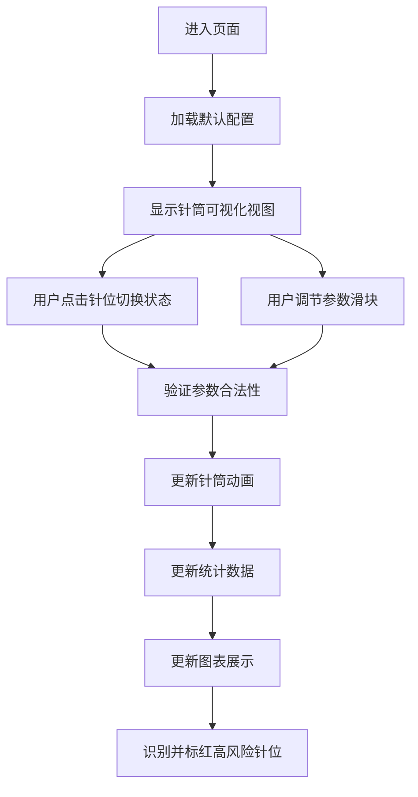

## 1. 产品概述

手摇织袜机针筒模拟器是一款基于 Web 的交互式可视化工具，用于模拟针织袜机的针筒运作过程，帮助用户理解针位启停、花型循环和断针风险等核心概念。

- 主要用途：教学演示、工艺参数调优、断针风险预测
- 目标用户：纺织工程专业学生、针织工艺工程师、袜机操作人员
- 产品价值：通过直观的可视化交互，降低学习成本，辅助工艺设计决策

## 2. 核心功能

### 2.1 用户角色
| 角色 | 注册方式 | 核心权限 |
|------|----------|----------|
| 普通用户 | 无需注册 | 完整使用模拟器所有功能 |

### 2.2 功能模块
1. **针筒可视化视图**：圆形针筒展示、针位状态显示、旋转动画、高风险针位标红
2. **控制面板**：针位开关、花型周期设置、线材张力调节、转速控制
3. **统计面板**：启用针数统计、花型重复节奏、高风险针位列表、张力分布图表

### 2.3 页面详情
| 页面名称 | 模块名称 | 功能描述 |
|----------|----------|----------|
| 主页面 | 针筒可视化 | PixiJS 绘制圆形针筒，支持点击切换针位状态，实时旋转动画 |
| 主页面 | 控制面板 | 滑块/数字输入调节参数，快速预设按钮，参数验证提示 |
| 主页面 | 统计面板 | 实时统计数据展示，Recharts 张力分布图，高风险针位列表 |

## 3. 核心流程

用户进入页面 → 查看默认针筒配置 → 点击针位切换启用/停用状态 → 调节花型周期、张力、转速参数 → 观察针筒旋转动画 → 查看实时统计数据和图表 → 识别高风险针位

## 4. 用户界面设计

### 4.1 设计风格
- **设计方向**：工业科技风，深色主题，强调数据可视化的专业性
- **主色调**：深蓝色 (#1e3a5f) 作为主色，搭配青色 (#00d4ff) 强调色
- **辅助色**：红色 (#ff4757) 用于高风险警示，绿色 (#2ed573) 用于正常状态
- **字体**：使用 JetBrains Mono 等宽字体展示数据，搭配现代无衬线字体
- **布局**：三栏式布局，左侧控制面板，中间针筒视图，右侧统计面板
- **视觉元素**：金属质感纹理、发光边框、科技感数据面板

### 4.2 页面设计概述
| 页面名称 | 模块名称 | UI 元素 |
|----------|----------|----------|
| 主页面 | 针筒可视化 | 圆形金属针筒、发光针位、旋转动画、悬浮高亮、点击反馈 |
| 主页面 | 控制面板 | 参数滑块、数字输入框、预设按钮、验证错误提示、分组卡片 |
| 主页面 | 统计面板 | 数据卡片、柱状图、风险列表、状态指示灯、实时更新动画 |

### 4.3 响应性
- 桌面端优先设计，三栏布局
- 中等屏幕：左右面板可折叠
- 移动端：垂直堆叠布局，针筒视图自适应大小

### 4.4 动画与交互
- 针筒平滑旋转动画，速度可调节
- 针位点击缩放反馈效果
- 参数调节时数据过渡动画
- 高风险针位脉冲闪烁警示
- 页面加载时元素渐入动画
