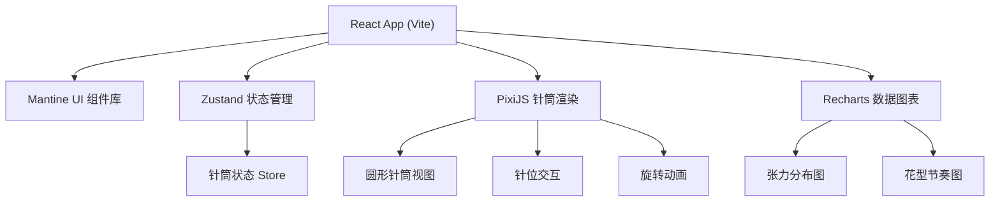

## 1. 架构设计



## 2. 技术描述

- **前端框架**: React 18 + TypeScript
- **构建工具**: Vite 5
- **UI 组件库**: Mantine v7
- **状态管理**: Zustand
- **图形渲染**: PixiJS v7
- **图表库**: Recharts
- **样式方案**: Mantine 内置样式系统 + CSS 变量
- **包管理器**: npm

## 3. 目录结构

```
src/
├── components/
│   ├── NeedleCylinder/      # PixiJS 针筒组件
│   ├── ControlPanel/        # 控制面板组件
│   ├── StatsPanel/          # 统计面板组件
│   └── common/              # 通用组件
├── hooks/                   # 自定义 Hooks
├── store/                   # Zustand 状态管理
├── types/                   # TypeScript 类型定义
├── utils/                   # 工具函数
├── pages/
│   └── HomePage.tsx         # 主页面
├── App.tsx
├── main.tsx
└── index.css
```

## 4. 状态管理设计

### 4.1 针筒状态 Store

```typescript
interface NeedleState {
  id: number;
  enabled: boolean;
  tension: number;
}

interface CylinderState {
  totalNeedles: number;
  needles: NeedleState[];
  patternPeriod: number;
  baseTension: number;
  rotationSpeed: number;
  isRunning: boolean;
  
  // Actions
  toggleNeedle: (id: number) => void;
  setPatternPeriod: (period: number) => void;
  setBaseTension: (tension: number) => void;
  setRotationSpeed: (speed: number) => void;
  setTotalNeedles: (count: number) => void;
  toggleRunning: () => void;
  resetAll: () => void;
}
```

## 5. 核心组件定义

### 5.1 NeedleCylinder 组件
- 使用 PixiJS 渲染圆形针筒
- 支持针位点击切换
- 实时旋转动画
- 高风险针位红色高亮
- 花型周期可视化标记

### 5.2 ControlPanel 组件
- 总针数设置
- 花型周期滑块
- 基础张力调节
- 转速控制
- 启停按钮
- 重置按钮
- 参数验证提示

### 5.3 StatsPanel 组件
- 启用针数统计
- 花型重复节奏计算
- 高风险针位列表
- 张力分布柱状图 (Recharts)
- 实时数据更新

## 6. 参数验证规则

1. **总针数**: 必须 > 0，默认 48 针
2. **针位状态**: 同一针位不能同时启用和停用（互斥状态）
3. **转速**: 必须 > 0，范围 0.1 - 10 转/秒
4. **张力**: 必须 > 0，范围 1 - 100
5. **花型周期**: 不能超过总针数，必须 > 0
6. **高风险判定**: 张力 > 阈值（默认 80）的启用针位标红

## 7. 性能考虑

- PixiJS 使用 WebGL 硬件加速渲染
- 状态更新使用批量更新减少重渲染
- 动画使用 requestAnimationFrame
- 图表数据节流更新
- 针位交互使用事件委托
